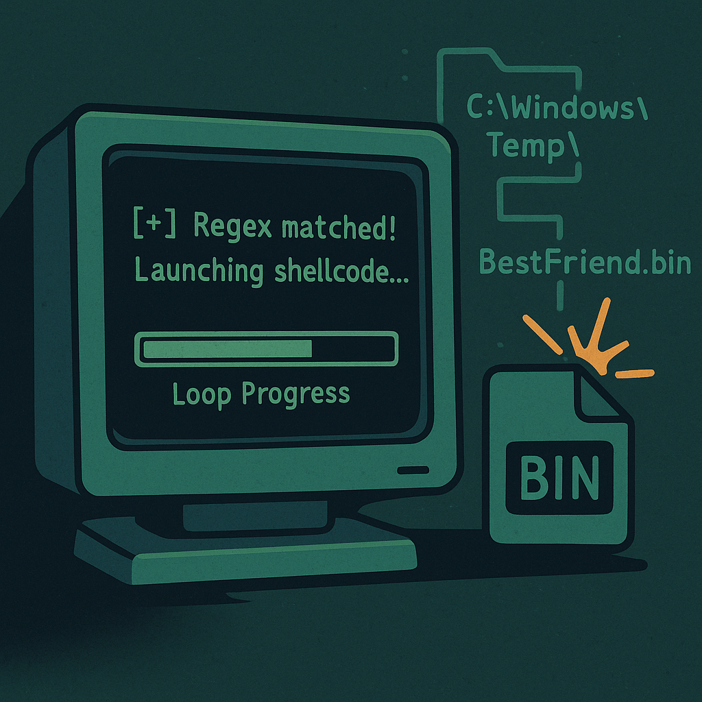

This is a custom C++ loader that reads a raw shellcode payload from C:\Windows\Temp\BestFriend.bin, allocates RWX (read/write/execute) memory, copies the shellcode into that memory, and executes it in the current process.
The loader includes some basic anti-analysis logic, such as a time-wasting loop and a check to make sure it’s being run as BestFriendLoader.exe.
Once executed, the shellcode will run in-memory and establish whatever connection (or perform whatever action) the raw payload is designed for—typically a Cobalt Strike stageless or staged beacon, as used in red team/CRTO engagements.

How to Use This Loader:

1. **Generate Your Shellcode**
    - Use your C2 framework (Cobalt Strike, etc.) to generate a **stageless raw payload** (`BestFriend.bin`) for your listener.
2. **Copy Shellcode to Target**
    - Transfer `BestFriend.bin` to `C:\Windows\Temp\BestFriend.bin` on the victim system.
    - You must have write permissions to Temp (default for most users)._
3. **Build the Loader**
    - Use Visual Studio or g++ with MinGW to build it out
4. **Copy Loader to Target**
    - Transfer `BestFriendLoader.exe` (your compiled loader) to any location you want, but it **must** be named exactly `BestFriendLoader.exe` (unless you change the regex in source).
5. **Run the Loader**
    - Double-click, run from cmd, or execute remotely.
    - If successful, your C2 session should light up.

